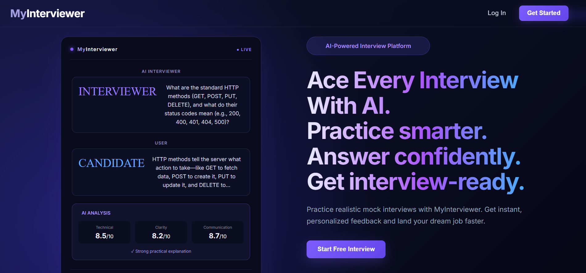
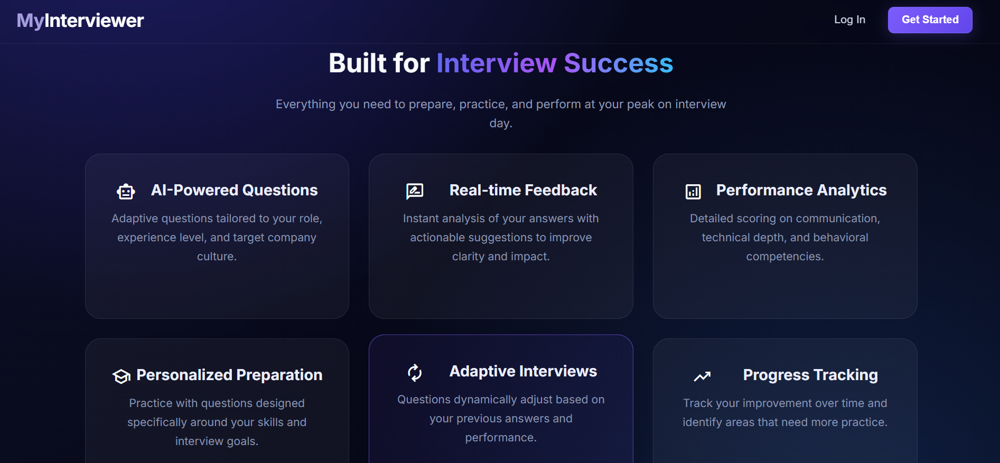
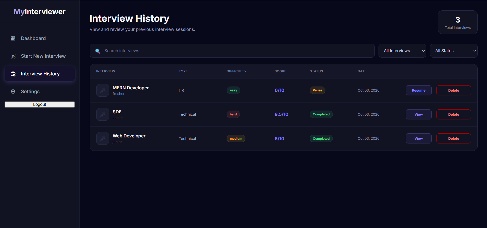
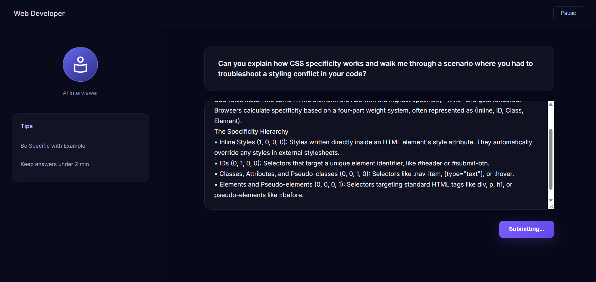
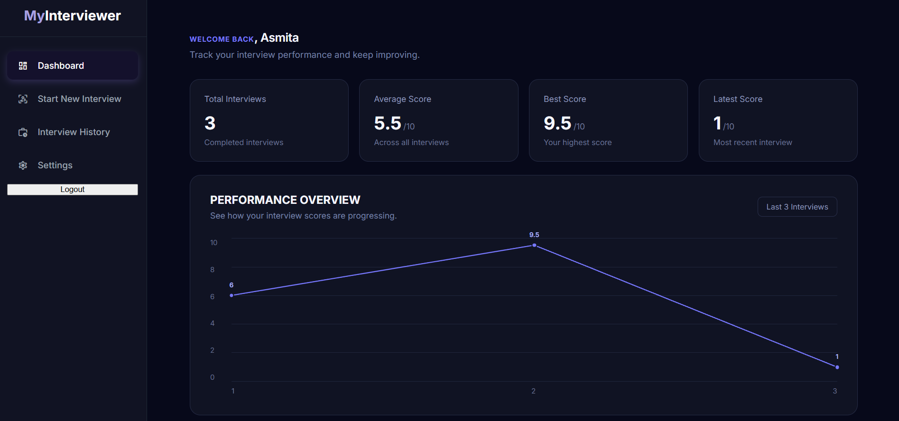
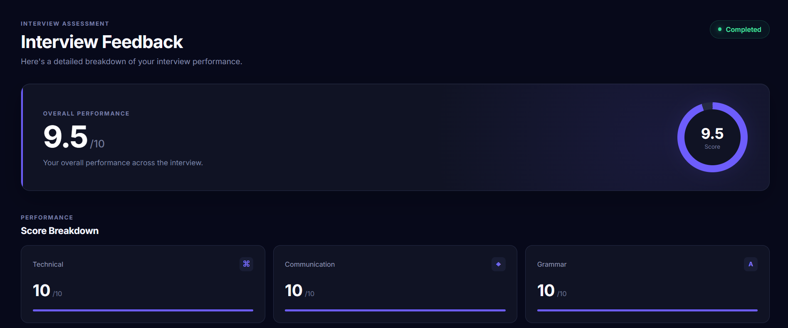
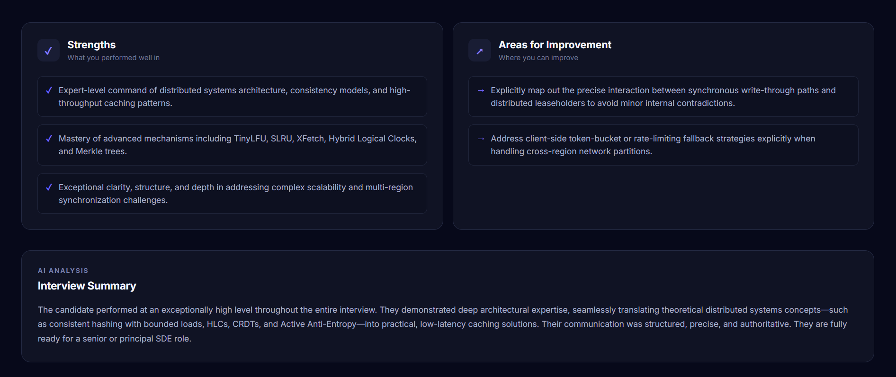
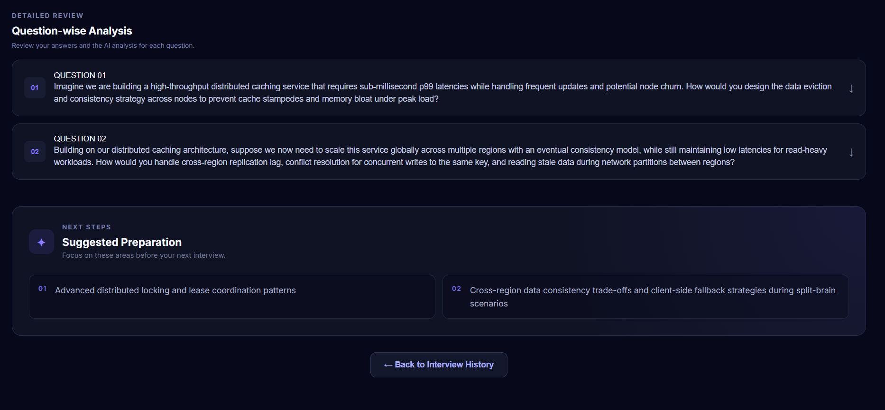

# MyInterviewer

MyInterviewer is an AI-powered interview practice platform designed to simulate structured technical, HR, and behavioral interviews. It generates interview questions, analyzes candidate responses, provides follow-up questions when required, and generates a final performance report.


## Features

- User registration and authentication
- AI-generated interview questions
- Technical, HR, and behavioral interview modes
- Configurable interview difficulty
- AI-based answer analysis and scoring
- Context-aware follow-up questions
- Final interview performance feedback
- User Dashboard, Interview history and session management
- Pause and resume functionality
- Protected routes and user-specific interview data

---


## Tech Stack

### Frontend
- React
- React Router
- CSS

### Backend
- Node.js
- Express.js
- REST APIs

### Database
- MongoDB
- Mongoose

### AI
- Google Gemini API

### Authentication
- JSON Web Tokens (JWT)
- HTTP-only Cookies

### Development Tools
- Git
- GitHub
- Visual Studio Code


## How It Works

```text
                 ┌──────────────────────┐
                 │ Configure Interview  │
                 │                      │
                 │ Role                 │
                 │ Experience           │
                 │ Difficulty           │
                 │ Interview Type       │
                 └──────────┬───────────┘
                            │
                            ▼
                 ┌──────────────────────┐
                 │   Start Interview    │
                 └──────────┬───────────┘
                            │
                            ▼
                 ┌──────────────────────┐
                 │  AI Generates        │
                 │  Interview Question  │
                 └──────────┬───────────┘
                            │
                            ▼
                 ┌──────────────────────┐
                 │   User Submits       │
                 │      Answer          │
                 └──────────┬───────────┘
                            │
                            ▼
                 ┌──────────────────────┐
                 │   Continue Interview │
                 │   Until Completion   │
                 └──────────┬───────────┘
                            │
                            ▼
                 ┌──────────────────────┐
                 │   AI Evaluates       │
                 │   Overall Performance│
                 └──────────┬───────────┘
                            │
                            ▼
                 ┌──────────────────────┐
                 │   Final Feedback     │
                 │                      │
                 │ Scores               │
                 │ Strengths            │
                 │ Improvements         │
                 │ Summary              │
                 │ Preparation          │
                 └──────────────────────┘
```

---

## 🛠️ Tech Stack

### Frontend

* React
* JavaScript
* HTML
* CSS
* React Router

### Backend

* Node.js
* Express.js
* REST API
* Mongoose

### Database

* MongoDB
* MongoDB Atlas

### AI

* Google Gemini API

### Development Tools

* Git
* GitHub
* Visual Studio Code
* npm

---


## Interview Workflow

1. The candidate selects the interview role, experience level, difficulty, and interview type.
2. The system generates an interview question using the Gemini API.
3. The candidate submits an answer.
4. The system analyzes the response for relevance, quality, and completeness.
5. Based on the analysis, the system either generates the next question or asks a follow-up question.
6. After the interview is completed, the system generates a final performance report with scores, strengths, areas for improvement, and preparation suggestions.


## Project Structure


```text
MyInterviewer/
│
├── frontend/
│   ├── .env.example
|   |
|   |
│   ├── src/
│   │   ├── api/
│   │   |   └── interviewApi.js
|   |   |
│   │   ├── components/
│   │   |   └── FeatureCard.jsx
│   │   |   └── Features.jsx
│   │   |   └── interviewDemoCard.jsx
│   │   |   └── Progress.jsx
│   │   |   └── ProgressCard.js
|   |   |
│   │   ├── components/
│   │   |   └── Footer.jsx
│   │   |   └── MainFooter.jsx
│   │   |   └── Navbar.jsx
|   |   |
│   │   ├── context/
│   │   |   └── MyContext.jsx
|   |   |
│   │   ├── interview/
│   │   |   └── Feedback.jsx
│   │   |   └── interview.jsx
│   │   |   └── interviewSetup.jsx
|   |   |
│   │   ├── pages/
│   │   │   ├── auth/
|   |   |   |    └── Login.jsx
|   |   |   |    └── Register.jsx
│   │   │   └── user/
|   |   |   |    ├── dashboard/
|   |   |   |    ├── interviewhistory/
|   |   |   |    ├── settings/
│   │   │   |    └── User.jsx
│   │   |   └── Landpage.jsx
│   │   └── ...
│   └── ...
│
└── backend/
    ├── controllers/
    │   └── authController.js
    │   └── dashboardController.js
    │   └── interviewController.js
    │   └── userController.js
    │
    ├── middlewares/
    │   └── authMiddleware.js
    │   └── validationMiddleware.js
    ├── models/
    │   ├── interviewSession.js
    │   ├── response.js
    │   └── user.js
    │
    ├── routes/
    │   └── authRoutes.js
    │   └── interviewRoutes.js
    │   └── userRoutes.js
    │
    ├── utils/
    |   └── prompts
    |   |    └── questionPrompt.js
    │   |   └── analysisPrompt.js
    │   |   └── followupPrompt.js
    │   |    └── finalFeedbackPrompt.js
    |   └── generateQuestions.js
    │   └── analyseAnswers.js
    │   └── generateFollowups.js
    │   └── generateFinalFeedback.js
    |
    ├── validations/
    │   └── authValidation.js
    │   └── interviewValidation.js
    |
    ├── env.example
    |
    |
    └── server.js
```

> The structure may evolve as extra features are implemented.

---


## AI Integration

The Gemini API is used to provide the core AI functionality of MyInterviewer.

- Generates interview questions based on the selected interview configuration
- Analyzes candidate responses
- Determines whether a follow-up question is required
- Generates context-aware follow-up questions
- Produces a final interview performance report


## Authentication and Security

MyInterviewer implements authentication and authorization to protect user accounts and interview data.

- Passwords are securely hashed before being stored.
- JWT-based authentication is used for user sessions.
- Authentication tokens are stored using HTTP-only cookies.
- Protected routes require user authentication.
- Users can access only their own interview sessions and data.
- Environment variables are used to protect sensitive configuration and API credentials.
- CORS is configured to control cross-origin requests.


## Setup and Installation

### Prerequisites

- Node.js
- MongoDB
- Gemini API key


### Installation

1. Clone the repository.
2. Navigate to the frontend directory and install the dependencies.
3. Navigate to the backend directory and install the dependencies.
4. Create the required environment variables.
5. Start the backend server.
6. Start the frontend development server.

The application can then be accessed through the local frontend URL.


## Environment Variables

The project includes `.env.example` files that provide the required environment variable structure.

1. Create a `.env` file based on the provided `.env.example`.
2. Add the required database, authentication, and Gemini API credentials.
3. Do not commit the `.env` file or expose sensitive credentials.


## Running the Application

Start the backend server:

```bash
cd backend
npm install
npm run dev
```
Start the frontend server in different terminal:

```bash
cd frontend
npm install
npm run dev
```

## Clone the Repository

```bash
git clone https://github.com/your-username/MyInterviewer.git
cd MyInterviewer
```
---


# Usage

1. Open the application.
2. Configure an interview.
3. Select the desired:

   * Role
   * Experience level
   * Difficulty
   * Interview type
4. Start the interview.
5. Read the AI-generated question.
6. Submit your answer.
7. Continue through the interview.
8. Complete the interview session.
9. Review the AI-generated performance report.
10. Revisit previous interviews through the interviewhistory section.

---


# 📌 Current Development Status

### Implemented

* [x] Interview configuration
* [x] Interview session creation
* [x] Role-based interview setup
* [x] Experience-level selection
* [x] Difficulty selection
* [x] Interview-type selection
* [x] AI-generated interview questions
* [x] Answer submission
* [x] Interview session management
* [x] Interview completion flow
* [x] AI-generated final feedback
* [x] Overall performance scoring
* [x] Technical scoring
* [x] Communication scoring
* [x] Grammar scoring
* [x] Strengths and improvement suggestions
* [x] Suggested preparation topics
* [x] Interview history foundation
* [x] User schema
* [x] User registration/login
* [x] JWT authentication
* [x] Complete User dashboard 
* [x] Performance analytics
* [x] Protected routes
* [x] Core AI advancement
* [x] Answer specific scoring
* [x] Answer specific suggesstions
* [x] Pause/Resume interview session
* [x] Delete Session

### 🚧 In Progress

* [ ] Duration based interview sessions
* [ ] User settings

### Planned

* [ ] Email verification
* [ ] Password reset
* [ ] Speech-to-text interview answers
* [ ] Voice-based interview interaction
* [ ] More advanced performance analytics
* [ ] Personalized preparation recommendations
* [ ] Interview performance trends
* [ ] Improved AI personalization
* [ ] More interview categories


---

# Future Vision

The goal of AI Interviewer is to evolve from a simple interview-practice application into a **personalized AI interview preparation platform**.

Future versions could help users identify recurring weaknesses across multiple interviews and generate targeted preparation plans based on their performance.

For example:

```text
Interview History
       │
       ▼
Performance Analysis
       │
       ▼
Identify Weak Areas
       │
       ▼
Personalized Preparation
       │
       ▼
Better Future Interviews
```

---

# What I Learned

This project is helping me gain practical experience with:

* Full-stack application architecture
* React-based frontend development
* REST API design
* Express.js backend development
* MongoDB data modeling
* Mongoose
* AI API integration
* Managing multi-step application workflows
* Structured AI responses
* User-specific data handling
* Dashboard and history design
* Error handling and middleware
* Building a real-world application rather than isolated features

---

## Screenshots

### Landing Page



### Interview History


### AI Interview


### Dashboard


### Interview Feedback




---


---

# 🤝 Contributing

Contributions, suggestions, and feedback are welcome.

If you'd like to contribute:

```bash
# Fork the repository

# Create a new branch
git checkout -b feature/your-feature

# Commit your changes
git commit -m "Add your feature"

# Push the branch
git push origin feature/your-feature
```

Then open a Pull Request.

---

# 📄 License

This project is currently developed as a personal learning and portfolio project.

A formal open-source license may be added in a future release.

---

# Author

**Asmita Chowdhury**

B.Tech Computer Science & Engineering

Interested in software engineering, AI-integrated applications and full-stack development.

---

⭐ If you find this project interesting, consider giving the repository a star!
